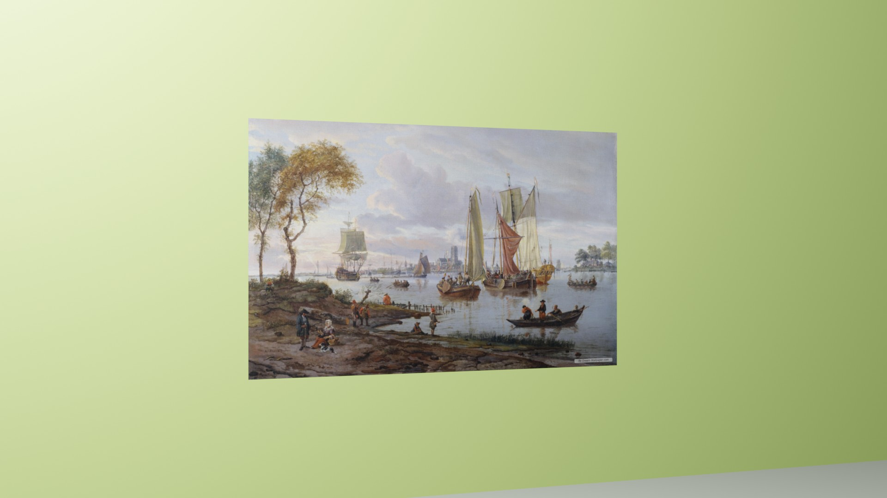

# ArtworkRetrievalDataGen

Artwork image retrieval synthetic data generator

## Installation

You will need to have `blender` 3.5 installed.  
  
Import image as planes addon is used and needs to be activated.  
  
To install the project, clone the repo.

```bash
git clone https://github.com/Oxid15/ArtworkRetrievalDataGen.git
```

## Usage

1. Create the folder with source images and the one for results

    ```bash
    mkdir src
    mkdir dst
    ```

2. Adjust parameters in the file `generate.py`
3. Run the rendering

    ```bash
    <path-to-your-blender>/blender -b -P <path-to-this-repo>/ArtworkRetrievalDataGen/generate.py
    ```

4. Review the results in the destination folder

    
